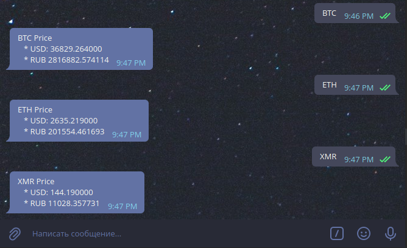

## CryptoBot 

###Описание
Простенький бот, который позволяет получить курс монеты в USD и RUB

Поддерживаемые монеты на данный момент:  
- XMR  
- ETH
- BTC

В дальнейшем количество монет будет увеличиваться 

###Детали реализации:  

Для получения данных используются бесплатные api от CoinGecko и Bittrix.com  

Для получения курса валют (USD-RUB) используется открытое XML-API ЦБ РФ
###Пример работы бота:


###Конфигурация:  

Конфигурация производится через файл config.toml в корне проекта.

api-keys.TelegramKey - здесь указывается api ключ для telegram-бота:  
``` toml
[api-keys]
    TelegramKey = "example:key"
```

###Сборка и запуск
####Сборка:
``` bash
go build cmd/bot/main.go -o crypto_bot 
```
####Запуск:
``` bash
./crypto_bot
```

